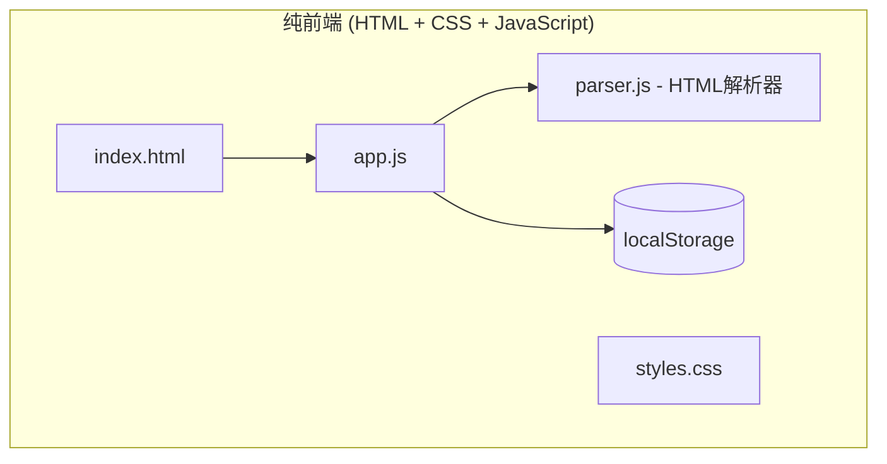

# Design Document: 超星学习通刷题平台

## Overview

本系统是一个简单的纯前端刷题平台，使用原生HTML/CSS/JavaScript实现，无需任何框架。从超星学习通HTML源码中提取题目数据，直接渲染到网页上进行在线练习。所有数据存储在浏览器的localStorage中。

## Architecture



### 技术栈选择

| 层级 | 技术 | 理由 |
|------|------|------|
| 页面结构 | HTML5 | 原生，无需构建 |
| 样式 | CSS3 | 原生，简单直接 |
| 逻辑 | JavaScript (ES6+) | 原生，浏览器直接运行 |
| 数据存储 | localStorage | 浏览器内置，无需后端 |
| HTML解析 | DOMParser | 浏览器原生API |

## Components and Interfaces

### 文件结构

```
quiz-platform/
├── index.html          # 主页面
├── styles.css          # 样式文件
├── js/
│   ├── app.js          # 主应用逻辑
│   ├── parser.js       # HTML解析器
│   ├── storage.js      # localStorage操作
│   └── utils.js        # 工具函数
└── README.md
```

### 1. HTML解析器 (parser.js)

负责从超星学习通HTML源码中提取题目数据。

```javascript
/**
 * 解析超星学习通HTML，提取题目数据
 * @param {string} html - HTML源码字符串
 * @returns {Object} 解析结果 { success, questions, errors, metadata }
 */
function parseHTML(html) {
  const parser = new DOMParser();
  const doc = parser.parseFromString(html, 'text/html');
  
  // 提取作业标题
  const title = doc.querySelector('.mark_title')?.textContent?.trim() || '未命名题库';
  
  // 提取所有题目
  const questionElements = doc.querySelectorAll('.questionLi.singleQuesId');
  const questions = [];
  const errors = [];
  
  questionElements.forEach((el, index) => {
    try {
      const question = parseQuestion(el);
      questions.push(question);
    } catch (e) {
      errors.push({ index, message: e.message });
    }
  });
  
  return {
    success: errors.length === 0,
    questions,
    errors,
    metadata: { title, totalCount: questions.length }
  };
}

/**
 * 解析单个题目元素
 * @param {Element} el - 题目DOM元素
 * @returns {Object} 题目对象
 */
function parseQuestion(el) {
  const id = el.getAttribute('data') || el.id.replace('question', '');
  const titleEl = el.querySelector('.mark_name');
  
  // 提取序号和题型
  const sequenceMatch = titleEl?.textContent?.match(/^(\d+)\./);
  const sequence = sequenceMatch ? parseInt(sequenceMatch[1]) : 0;
  
  const typeEl = el.querySelector('.colorShallow');
  const typeText = typeEl?.textContent?.replace(/[()（）]/g, '') || '';
  const type = getQuestionType(typeText);
  
  // 提取题目内容
  const content = el.querySelector('.qtContent')?.innerHTML?.trim() || '';
  
  // 提取选项（选择题）
  const options = [];
  el.querySelectorAll('.mark_letter li').forEach(li => {
    const text = li.textContent?.trim() || '';
    const match = text.match(/^([A-Z])\.\s*(.*)$/);
    if (match) {
      options.push({ label: match[1], content: match[2] });
    }
  });
  
  // 提取正确答案
  const answer = el.querySelector('.rightAnswerContent')?.textContent?.trim() || '';
  
  return { id, sequence, type, content, options, answer };
}

/**
 * 根据文本获取题目类型
 */
function getQuestionType(text) {
  if (text.includes('单选')) return 'single';
  if (text.includes('多选')) return 'multiple';
  if (text.includes('材料')) return 'material';
  if (text.includes('论述')) return 'essay';
  return 'unknown';
}
```

### 2. 存储模块 (storage.js)

管理localStorage的读写操作。

```javascript
const STORAGE_KEYS = {
  BANKS: 'quiz_banks',
  WRONG: 'quiz_wrong',
  PROGRESS: 'quiz_progress'
};

/**
 * 保存题库
 */
function saveBanks(banks) {
  localStorage.setItem(STORAGE_KEYS.BANKS, JSON.stringify(banks));
}

/**
 * 获取所有题库
 */
function getBanks() {
  const data = localStorage.getItem(STORAGE_KEYS.BANKS);
  return data ? JSON.parse(data) : [];
}

/**
 * 添加错题
 */
function addWrongQuestion(questionId, bankId, wrongAnswer) {
  const wrong = getWrongQuestions();
  const existing = wrong.find(w => w.questionId === questionId);
  
  if (existing) {
    existing.wrongCount++;
    existing.lastWrongAt = Date.now();
  } else {
    wrong.push({
      questionId,
      bankId,
      wrongAnswer,
      wrongCount: 1,
      isMastered: false,
      lastWrongAt: Date.now()
    });
  }
  
  localStorage.setItem(STORAGE_KEYS.WRONG, JSON.stringify(wrong));
}

/**
 * 获取错题列表
 */
function getWrongQuestions() {
  const data = localStorage.getItem(STORAGE_KEYS.WRONG);
  return data ? JSON.parse(data) : [];
}
```

### 3. 主应用 (app.js)

页面交互和渲染逻辑。

```javascript
// 全局状态
let currentBank = null;
let currentQuestions = [];
let currentIndex = 0;
let sessionStats = { correct: 0, total: 0 };

/**
 * 初始化应用
 */
function init() {
  loadBanks();
  bindEvents();
}

/**
 * 绑定事件
 */
function bindEvents() {
  // 文件上传
  document.getElementById('fileInput').addEventListener('change', handleFileUpload);
  
  // 答案提交
  document.getElementById('submitBtn').addEventListener('click', submitAnswer);
  
  // 下一题
  document.getElementById('nextBtn').addEventListener('click', nextQuestion);
}

/**
 * 处理文件上传
 */
async function handleFileUpload(e) {
  const file = e.target.files[0];
  if (!file) return;
  
  const html = await file.text();
  const result = parseHTML(html);
  
  if (result.questions.length > 0) {
    const bank = {
      id: Date.now().toString(),
      name: result.metadata.title,
      questions: result.questions,
      totalCount: result.questions.length,
      createdAt: Date.now()
    };
    
    const banks = getBanks();
    banks.push(bank);
    saveBanks(banks);
    
    loadBanks();
    alert(`成功导入 ${result.questions.length} 道题目！`);
  }
}

/**
 * 渲染题目
 */
function renderQuestion(question) {
  const container = document.getElementById('questionContainer');
  
  let html = `
    <div class="question">
      <div class="question-header">
        <span class="question-number">第 ${question.sequence} 题</span>
        <span class="question-type">${getTypeLabel(question.type)}</span>
      </div>
      <div class="question-content">${question.content}</div>
  `;
  
  if (question.options && question.options.length > 0) {
    html += '<div class="options">';
    question.options.forEach(opt => {
      html += `
        <label class="option">
          <input type="${question.type === 'multiple' ? 'checkbox' : 'radio'}" 
                 name="answer" value="${opt.label}">
          <span>${opt.label}. ${opt.content}</span>
        </label>
      `;
    });
    html += '</div>';
  }
  
  html += '</div>';
  container.innerHTML = html;
}

/**
 * 渲染题型分类导航
 */
function renderTypeNav(bank) {
  const nav = document.getElementById('typeNav');
  const types = {};
  
  // 统计各题型数量
  bank.questions.forEach(q => {
    types[q.type] = (types[q.type] || 0) + 1;
  });
  
  let html = '<div class="type-nav">';
  html += `<button class="type-btn active" data-type="all">全部 (${bank.totalCount})</button>`;
  
  Object.entries(types).forEach(([type, count]) => {
    html += `<button class="type-btn" data-type="${type}">${getTypeLabel(type)} (${count})</button>`;
  });
  
  html += '</div>';
  nav.innerHTML = html;
  
  // 绑定点击事件
  nav.querySelectorAll('.type-btn').forEach(btn => {
    btn.addEventListener('click', () => filterByType(btn.dataset.type));
  });
}

/**
 * 按题型筛选题目
 */
function filterByType(type) {
  // 更新按钮状态
  document.querySelectorAll('.type-btn').forEach(btn => {
    btn.classList.toggle('active', btn.dataset.type === type);
  });
  
  // 筛选题目
  if (type === 'all') {
    currentQuestions = [...currentBank.questions];
  } else {
    currentQuestions = currentBank.questions.filter(q => q.type === type);
  }
  
  currentIndex = 0;
  renderQuestionList();
  if (currentQuestions.length > 0) {
    renderQuestion(currentQuestions[0]);
  }
}

/**
 * 渲染题目列表（按题型分组）
 */
function renderQuestionList() {
  const list = document.getElementById('questionList');
  
  // 按题型分组
  const grouped = {};
  currentQuestions.forEach(q => {
    if (!grouped[q.type]) grouped[q.type] = [];
    grouped[q.type].push(q);
  });
  
  let html = '';
  Object.entries(grouped).forEach(([type, questions]) => {
    html += `
      <div class="question-group">
        <h3 class="group-title">${getTypeLabel(type)} (${questions.length}题)</h3>
        <div class="question-items">
    `;
    
    questions.forEach((q, idx) => {
      html += `
        <button class="question-item ${idx === 0 && type === currentQuestions[0]?.type ? 'active' : ''}" 
                data-id="${q.id}" data-index="${currentQuestions.indexOf(q)}">
          ${q.sequence}
        </button>
      `;
    });
    
    html += '</div></div>';
  });
  
  list.innerHTML = html;
  
  // 绑定点击事件
  list.querySelectorAll('.question-item').forEach(item => {
    item.addEventListener('click', () => {
      currentIndex = parseInt(item.dataset.index);
      renderQuestion(currentQuestions[currentIndex]);
      updateActiveItem();
    });
  });
}

/**
 * 提交答案
 */
function submitAnswer() {
  const question = currentQuestions[currentIndex];
  const inputs = document.querySelectorAll('input[name="answer"]:checked');
  const userAnswer = Array.from(inputs).map(i => i.value).join('');
  
  const isCorrect = userAnswer === question.answer;
  sessionStats.total++;
  
  if (isCorrect) {
    sessionStats.correct++;
    showFeedback('correct', '回答正确！');
  } else {
    addWrongQuestion(question.id, currentBank.id, userAnswer);
    showFeedback('wrong', `回答错误！正确答案是：${question.answer}`);
  }
  
  updateProgress();
}
```

## Data Models

### 核心数据模型

```javascript
// 题目类型
const QuestionType = {
  SINGLE: 'single',      // 单选题
  MULTIPLE: 'multiple',  // 多选题
  MATERIAL: 'material',  // 材料题
  ESSAY: 'essay'         // 论述题
};

// 题目对象
const Question = {
  id: '',           // 唯一标识
  sequence: 0,      // 题目序号
  type: '',         // 题目类型
  content: '',      // 题目内容（HTML）
  options: [],      // 选项列表 [{ label: 'A', content: '...' }]
  answer: ''        // 正确答案
};

// 题库对象
const QuestionBank = {
  id: '',           // 题库ID
  name: '',         // 题库名称
  questions: [],    // 题目列表
  totalCount: 0,    // 题目总数
  createdAt: 0      // 创建时间戳
};

// 错题记录
const WrongQuestion = {
  questionId: '',   // 题目ID
  bankId: '',       // 所属题库ID
  wrongAnswer: '',  // 错误答案
  wrongCount: 0,    // 错误次数
  isMastered: false,// 是否已掌握
  lastWrongAt: 0    // 最后错误时间
};
```

### localStorage数据结构

```javascript
// 存储键名
const STORAGE_KEYS = {
  BANKS: 'quiz_banks',      // 题库列表
  WRONG: 'quiz_wrong',      // 错题记录
  PROGRESS: 'quiz_progress' // 学习进度
};

// 存储格式
// quiz_banks: QuestionBank[]
// quiz_wrong: WrongQuestion[]
// quiz_progress: { [date]: { practiceCount, correctCount } }
```


## Correctness Properties

*A property is a characteristic or behavior that should hold true across all valid executions of a system—essentially, a formal statement about what the system should do. Properties serve as the bridge between human-readable specifications and machine-verifiable correctness guarantees.*

### Property 1: HTML解析完整性

*For any* 有效的超星学习通HTML源码，解析器应该提取出所有题目，且每个题目的ID、序号、题型、内容、选项（如适用）和正确答案都被正确提取。

**Validates: Requirements 1.1, 1.2, 1.3, 1.4**

### Property 2: 解析容错性

*For any* 包含部分格式错误的HTML源码，解析器应该成功解析所有格式正确的题目，并记录格式错误的题目信息，错误不应导致整个解析过程失败。

**Validates: Requirements 1.5**

### Property 3: 题目数据序列化Round-Trip

*For any* 解析得到的题目数据，序列化为JSON后再反序列化，应该得到与原始数据等价的对象。

**Validates: Requirements 1.6**

### Property 4: 题库查询正确性

*For any* 存储在题库中的题目集合，按题型筛选应该只返回指定题型的题目，按关键词搜索应该返回包含该关键词的所有题目。

**Validates: Requirements 2.3, 2.4**

### Property 5: 重复检测准确性

*For any* 已存在于题库中的题目，再次导入时应该被检测为重复，且不会创建新的记录。

**Validates: Requirements 2.2**

### Property 6: 级联删除完整性

*For any* 被删除的题目，其关联的错题记录和练习记录应该同步被删除或更新。

**Validates: Requirements 2.5**

### Property 7: 答案判定正确性

*For any* 用户提交的答案，系统判定的正误应该与答案是否匹配正确答案一致。

**Validates: Requirements 3.2**

### Property 8: 错题自动记录

*For any* 用户答错的题目，该题目应该自动出现在用户的错题本中，且错误次数正确累加。

**Validates: Requirements 3.3, 4.1, 4.4**

### Property 9: 练习统计准确性

*For any* 完成的练习会话，正确率应该等于正确答题数除以总答题数，且各题型的统计数据应该与实际答题情况一致。

**Validates: Requirements 3.5, 5.1, 5.2**

### Property 10: 错题掌握状态转换

*For any* 错题本中的题目，当用户在错题练习中答对该题时，该题应该被标记为已掌握。

**Validates: Requirements 4.3**

### Property 11: 数据持久化Round-Trip

*For any* 用户的学习数据（进度、错题、练习记录），存储后重新加载应该得到与原始数据等价的内容。

**Validates: Requirements 7.1, 7.2**

### Property 12: 数据导出导入Round-Trip

*For any* 导出的用户数据，重新导入后应该恢复到导出时的状态。

**Validates: Requirements 7.3**

## Error Handling

### 解析错误处理

| 错误类型 | 处理方式 |
|----------|----------|
| HTML格式无效 | 返回验证失败，提示用户检查文件格式 |
| 缺少必要元素 | 跳过该题目，记录错误信息 |
| 选项解析失败 | 尝试备用解析策略，失败则跳过 |
| 答案提取失败 | 标记为无答案题目，允许手动补充 |

### 业务错误处理

| 错误类型 | 处理方式 |
|----------|----------|
| 题库不存在 | 返回404错误，提示创建题库 |
| 重复导入 | 返回冲突列表，让用户选择覆盖或跳过 |
| 会话过期 | 自动保存进度，提示重新开始 |
| 存储空间不足 | 提示用户清理旧数据或升级存储 |

### 网络错误处理

| 错误类型 | 处理方式 |
|----------|----------|
| 请求超时 | 自动重试3次，失败后提示用户 |
| 服务器错误 | 显示友好错误信息，提供重试按钮 |
| 离线状态 | 使用本地缓存，恢复后同步 |

## Testing Strategy

由于是简单的HTML/CSS/JavaScript项目，测试可以简化为手动测试和基本的单元测试。

### 测试方法

1. **手动测试**: 直接在浏览器中打开index.html进行功能测试
2. **控制台测试**: 在浏览器控制台中测试解析器函数

### 关键测试用例

**HTML解析器测试**:
- 解析包含所有题型的完整HTML
- 解析包含特殊字符的题目内容
- 处理格式不完整的HTML

**存储功能测试**:
- 保存和读取题库
- 添加和查询错题
- 数据持久化验证

## 页面布局设计

### 响应式设计

支持PC端和手机端自适应布局。

**PC端布局 (>768px)**:
```
┌─────────────────────────────────────────────────────┐
│  [全部(244)] [单选(174)] [多选(34)] [材料] [论述]   │  ← 题型导航（横向）
├─────────────────────────────────────────────────────┤
│  ┌───────────┐  ┌─────────────────────────────────┐ │
│  │ 单选题(174)│  │ 第 1 题 [单选题]               │ │
│  │ [1][2][3] │  │                                 │ │
│  │ [4][5]... │  │ 题目内容...                     │ │
│  │           │  │                                 │ │
│  │ 多选题(34)│  │ ○ A. 选项A                     │ │
│  │ [175][176]│  │ ○ B. 选项B                     │ │
│  │ ...       │  │ ○ C. 选项C                     │ │
│  │           │  │ ○ D. 选项D                     │ │
│  │ 材料题    │  │                                 │ │
│  │ ...       │  │ [提交答案]  [下一题]            │ │
│  └───────────┘  └─────────────────────────────────┘ │
│    侧边栏(250px)        主内容区(自适应)             │
└─────────────────────────────────────────────────────┘
```

**手机端布局 (<768px)**:
```
┌─────────────────────────┐
│ [全部] [单选] [多选] ▶  │  ← 题型导航（可横向滚动）
├─────────────────────────┤
│ 第 1 题 [单选题]        │
│                         │
│ 题目内容...             │
│                         │
│ ○ A. 选项A              │
│ ○ B. 选项B              │
│ ○ C. 选项C              │
│ ○ D. 选项D              │
│                         │
│ [提交答案]              │
├─────────────────────────┤
│ ◀ [1][2][3][4][5]... ▶  │  ← 底部题号导航（可滚动）
└─────────────────────────┘
```

### CSS响应式样式

```css
/* 基础样式 */
* {
  box-sizing: border-box;
  margin: 0;
  padding: 0;
}

body {
  font-family: -apple-system, BlinkMacSystemFont, 'Segoe UI', Roboto, sans-serif;
  line-height: 1.6;
  color: #333;
  background: #f5f5f5;
}

.container {
  max-width: 1200px;
  margin: 0 auto;
  padding: 20px;
}

/* 题型导航 */
.type-nav {
  display: flex;
  gap: 10px;
  padding: 15px;
  background: #fff;
  border-radius: 8px;
  margin-bottom: 20px;
  overflow-x: auto;
  -webkit-overflow-scrolling: touch;
}

.type-btn {
  padding: 8px 16px;
  border: 1px solid #ddd;
  border-radius: 20px;
  background: #fff;
  cursor: pointer;
  white-space: nowrap;
  transition: all 0.2s;
}

.type-btn.active {
  background: #1890ff;
  color: #fff;
  border-color: #1890ff;
}

/* 主布局 - PC端 */
.main-layout {
  display: flex;
  gap: 20px;
}

.sidebar {
  width: 250px;
  flex-shrink: 0;
  background: #fff;
  border-radius: 8px;
  padding: 15px;
  max-height: calc(100vh - 200px);
  overflow-y: auto;
}

.content {
  flex: 1;
  background: #fff;
  border-radius: 8px;
  padding: 20px;
}

/* 题目列表 */
.question-group {
  margin-bottom: 20px;
}

.group-title {
  font-size: 14px;
  color: #666;
  margin-bottom: 10px;
  padding-bottom: 5px;
  border-bottom: 1px solid #eee;
}

.question-items {
  display: flex;
  flex-wrap: wrap;
  gap: 8px;
}

.question-item {
  width: 36px;
  height: 36px;
  border: 1px solid #ddd;
  border-radius: 4px;
  background: #fff;
  cursor: pointer;
  font-size: 14px;
  transition: all 0.2s;
}

.question-item.active {
  background: #1890ff;
  color: #fff;
  border-color: #1890ff;
}

.question-item.done {
  background: #52c41a;
  color: #fff;
  border-color: #52c41a;
}

.question-item.wrong {
  background: #ff4d4f;
  color: #fff;
  border-color: #ff4d4f;
}

/* 题目内容 */
.question {
  padding: 20px 0;
}

.question-header {
  display: flex;
  align-items: center;
  gap: 10px;
  margin-bottom: 15px;
}

.question-number {
  font-size: 16px;
  font-weight: bold;
}

.question-type {
  padding: 2px 8px;
  background: #e6f7ff;
  color: #1890ff;
  border-radius: 4px;
  font-size: 12px;
}

.question-content {
  font-size: 16px;
  line-height: 1.8;
  margin-bottom: 20px;
}

/* 选项 */
.options {
  display: flex;
  flex-direction: column;
  gap: 12px;
}

.option {
  display: flex;
  align-items: flex-start;
  gap: 10px;
  padding: 12px 15px;
  background: #fafafa;
  border-radius: 8px;
  cursor: pointer;
  transition: background 0.2s;
}

.option:hover {
  background: #f0f0f0;
}

.option input {
  margin-top: 4px;
}

/* 按钮 */
.btn-group {
  display: flex;
  gap: 10px;
  margin-top: 20px;
}

.btn {
  padding: 10px 24px;
  border: none;
  border-radius: 6px;
  cursor: pointer;
  font-size: 14px;
  transition: all 0.2s;
}

.btn-primary {
  background: #1890ff;
  color: #fff;
}

.btn-primary:hover {
  background: #40a9ff;
}

/* 反馈 */
.feedback {
  padding: 15px;
  border-radius: 8px;
  margin-top: 15px;
}

.feedback.correct {
  background: #f6ffed;
  border: 1px solid #b7eb8f;
  color: #52c41a;
}

.feedback.wrong {
  background: #fff2f0;
  border: 1px solid #ffccc7;
  color: #ff4d4f;
}

/* 手机端适配 */
@media (max-width: 768px) {
  .container {
    padding: 10px;
  }
  
  .main-layout {
    flex-direction: column;
  }
  
  .sidebar {
    display: none; /* 手机端隐藏侧边栏 */
  }
  
  .content {
    padding: 15px;
  }
  
  /* 底部题号导航 */
  .mobile-nav {
    display: flex;
    position: fixed;
    bottom: 0;
    left: 0;
    right: 0;
    background: #fff;
    padding: 10px;
    box-shadow: 0 -2px 8px rgba(0,0,0,0.1);
    overflow-x: auto;
    gap: 8px;
  }
  
  .question-content {
    font-size: 15px;
  }
  
  .option {
    padding: 10px 12px;
  }
  
  .btn-group {
    flex-direction: column;
  }
  
  .btn {
    width: 100%;
  }
}

/* PC端隐藏底部导航 */
@media (min-width: 769px) {
  .mobile-nav {
    display: none;
  }
}
```
